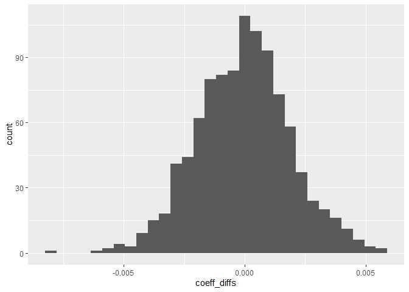
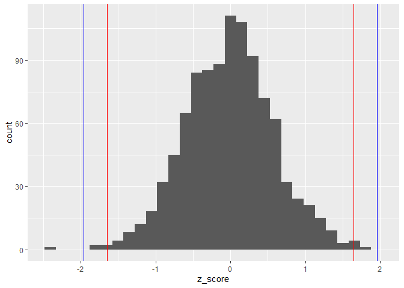

Angrist’s “The Perils of Peer Effects” (2014) discusses potential
pitfalls when identifying the causal effects of peer characteristics on
outcomes. This write up briefly summarizes the potential issues
discussed, Angrist’s proposed solutions, and provides simulations to
highlight both.

# Linear In-Means

Angrist first discusses a linear in means model of peer effects. The
most basic example of this equation takes the form
*y**i**j* = *β*0 + *β*1*ȳ**j* + *ϵ**i**j*,
for individual i in group j, with *ȳ**j* being the mean value
of y for group j. However, this equation always produces a
*β*1 with a value of 1. This can be seen with the following
simulation. In this simulation, 3 groups of equal size were assigned a
value of “1” for the variable “Yes” at different probabilities (so
members of Group A had a probability of 0.5 of being assigned 1, group B
had a proability of 0.2, etc.). The mean value of “Yes” for each each
group was then calculated and assigned to members of the groups,
recorded as “rate”. “Yes” was then regressed against “rate” to produce
the results below:

    ## 
    ## Call:
    ## lm(formula = yes ~ rate, data = combined_groups)
    ## 
    ## Residuals:
    ##     Min      1Q  Median      3Q     Max 
    ## -0.8007 -0.2003 -0.2003  0.1993  0.7997 
    ## 
    ## Coefficients:
    ##              Estimate Std. Error t value Pr(>|t|)    
    ## (Intercept) 1.548e-12  1.806e-03     0.0        1    
    ## rate        1.000e+00  3.246e-03   308.1   <2e-16 ***
    ## ---
    ## Signif. codes:  0 '***' 0.001 '**' 0.01 '*' 0.05 '.' 0.1 ' ' 1
    ## 
    ## Residual standard error: 0.4358 on 299998 degrees of freedom
    ## Multiple R-squared:  0.2403, Adjusted R-squared:  0.2403 
    ## F-statistic: 9.492e+04 on 1 and 299998 DF,  p-value: < 2.2e-16

This regression produces a coefficient of 1, as predicted by Angrist.

A more nuanced model controls for both individual and peer
characteristics, such as the model
*y* = *β**μ*(*y*|*z*) + *γ**x*, where y is the outcome of
interest, x is an individual covariate, and z is group membership. This
model attempts to attempt identify the peer effect of the mean of y in
group z on an individual’s y, holding z constant. This equation can be
rewritten to the form $E\[y|z\]=\frac{\gamma}{(1-\beta)}\\E\[x|z\]$,
meaning *β* in this equation acts as a “social multiplier” that
magnifies the effect of individual covariate changes. Angrist shows that
multiplier $\frac{1}{1-\beta}$ approximately equals the ratio of the
2SLS to OLS estimand of the effect of individual covariate x on y (with
being instrumented by group membership). As a result, *β* just captures
the divergence between the OLS and 2SLS estimates of the effect of x on
y, which may exist for reasons other than peer effects, such as weak
instruments in 2SLS that do not strongly affect the first stage. To
demonstrate how this can occur, I will simulate the Dartmouth high
school drinking paper Angrist discusses. In this example, I randomly
generated a dummy variable “high\_school”, indicating whether that
individual drank in high school. I used “high\_school” to determine the
probability of whether someone joined Greek life to capture the
influence of high school drinking on joining Greek life, marked by the
indicator variable “greek”. In this simulation, there are no peer
effects on high school drinking. Individuals were then assigned to
groups of “dorm”, “floor”, and “room”, with each grouping getting more
and more coarse. I then ran an OLS regression of “high\_school” against
“Greek”. I then ran 3 more 2SLS regressions of “high\_school” against
““Greek”, instrumenting “high\_school” with with group membership. The
results of these regressions are in the table below, with the
coefficients of OLS, 2SLS, their ratio, and their :

    ##          OLS Reg      OLS SE  2SLS Reg    2SLS SE    Ratio
    ## Dorms  0.1939014 0.009809229 1.5164050 1.76825014 7.820494
    ## Floors 0.1939014 0.009809229 0.3134256 0.19788206 1.616417
    ## Rooms  0.1939014 0.009809229 0.2201097 0.03777176 1.135163

Here, we see results consistent with what Angrist predicted. As
groupings becoming more coarse (moving from rooms to floors to dorms),
the ratio of the 2SLS to OLS coefficients increases while the standard
error of the 2SLS regression increases. The regression model captures
peer effects even though they do not exist in the data generating
process.

# Leave Out-Mean and Social Returns

Angrist then discusses the leave-out mean model of peer effects, which
take the form
*y**i**j* = *β*0 + *β*1*ȳ*(*i*)*j* + *ϵ**i**j*
for individual i in group j. Although this regression does not
automatically produce *β*1 = 1 (as the
*y**i**j* = *β*0 + *β*1*ȳ**j* + *ϵ**i**j*
did), Angrist argues it does not provide a causal interpretation of peer
characteristics, as it just captures intraclass correlation, such as
shocks common to groups.We can see this in the example below. Data was
generated for a population normally (referred to as “characteristic”),
with a mean of 50 and a standard deviation of 1. The observations were
grouped into 150 groups of 4 categories and each group received a random
“shock”. The “shock” and the observation’s “characteristic” value were
then summed together to create the value “characteristic\_mod”. The
leave out mean for “characteristic\_mod” was then calculated for each
individual and regressed against “characteristic\_mod”.

    ## 
    ## t test of coefficients:
    ## 
    ##              Estimate Std. Error t value  Pr(>|t|)    
    ## (Intercept) 27.258052   2.964153  9.1959 < 2.2e-16 ***
    ## leave_out    0.504339   0.053895  9.3579 < 2.2e-16 ***
    ## ---
    ## Signif. codes:  0 '***' 0.001 '**' 0.01 '*' 0.05 '.' 0.1 ' ' 1

As can be seen, the regression captures a statistically significant
effect of leave out mean. However, this is not capturing any causal
effect of leave out mean (since it does not exist in the data generating
process). Instead it is capturing intraclass correlation caused by group
specific shocks.

Angrist also discusses flaws with the social returns model,
*y* = *β*1*μ*(*x*|*z*) + *β*0*x*, which
is intended to capture the causal effect of the average value of x for
group z on outcome y, controlling for an individual’s value of x. The
social returns coefficient, *β*1, is proportional to the
difference between the 2SLS estimated coefficient of x from of
regressing x on y (instrumenting for x with z) and the OLS estimate of
the coefficient of x. *β*1 then does not necessarily capture
the causal effect of *μ*(*x*|*z*) on y, as the 2SLS estimate
can be greater than the OLS estimate for reasons such as measurement
error or omitted variable bias. How these can effect 2SLS can be seen in
the simulation below (I based it off the Acemoglu and Angrist paper
given as an example in the Angrist paper). Data was generated for the
“educ” variable and observations were grouped into categories of 10. A
“state\_effect” was also calculated. The variable “wages\_state” was
determined by the equation “wage\_state = 200 + 25*(educ\_state) +
20*state\_effect”, with “educ\_state” being the sum of educ and
state\_effect. The influence of “state\_effect” on wages acts as an
omitted variable bias by violating the exclusion of principle of using
states as an instrument.

    ## 
    ## Call:
    ## lm(formula = wage_state ~ educ_state, data = return_groups)
    ## 
    ## Residuals:
    ##      Min       1Q   Median       3Q      Max 
    ## -24.4324  -6.9470  -0.5286   6.7576  31.2562 
    ## 
    ## Coefficients:
    ##             Estimate Std. Error t value Pr(>|t|)    
    ## (Intercept) 155.2474     2.6342   58.94   <2e-16 ***
    ## educ_state   29.1706     0.1604  181.90   <2e-16 ***
    ## ---
    ## Signif. codes:  0 '***' 0.001 '**' 0.01 '*' 0.05 '.' 0.1 ' ' 1
    ## 
    ## Residual standard error: 9.847 on 998 degrees of freedom
    ## Multiple R-squared:  0.9707, Adjusted R-squared:  0.9707 
    ## F-statistic: 3.309e+04 on 1 and 998 DF,  p-value: < 2.2e-16

    ## 
    ## Call:
    ## ivreg(formula = wage_state ~ educ_state | group_number, data = return_groups)
    ## 
    ## Residuals:
    ##      Min       1Q   Median       3Q      Max 
    ## -119.859  -31.787   -1.637   29.418  124.325 
    ## 
    ## Coefficients:
    ##             Estimate Std. Error t value Pr(>|t|)
    ## (Intercept)  520.320   2077.708   0.250    0.802
    ## educ_state     6.789    127.380   0.053    0.958
    ## 
    ## Diagnostic tests:
    ##                  df1 df2 statistic p-value
    ## Weak instruments   1 998     0.032   0.857
    ## Wu-Hausman         1 997     0.633   0.426
    ## Sargan             0  NA        NA      NA
    ## 
    ## Residual standard error: 44.6 on 998 degrees of freedom
    ## Multiple R-Squared: 0.3992,  Adjusted R-squared: 0.3986 
    ## Wald test: 0.00284 on 1 and 998 DF,  p-value: 0.9575

    ## [1] -22.38187

As can be seen, the failure of the state instrument to satisfy the
exclusion restriction results in the 2SLS estimate of the effect of
education on wages to be bigger than the OLS estimate, creating the
appearance of peer effects. To demonstrate the effect of measurement
error, I also generated the variable “wages” from the equation “wage =
200 + 25\*(educ)” and the variable “educ\_noise”, which adds some
randomly generated noise of mean 0 to the “educ” variable. Regressing
wage on “educ\_noise” instead of “educ” will attenuate the OLS and 2SLS
measures of the effect of education on wage, but the attenuation will be
greater for OLS compared to 2SLS, creating a gap between the 2
coefficients and the appearance of peer effects. This effect can be seen
below.

    ## 
    ## Call:
    ## lm(formula = wage ~ educ_noise, data = return_groups)
    ## 
    ## Residuals:
    ##    Min     1Q Median     3Q    Max 
    ## -88.21 -16.67   0.63  17.48  82.35 
    ## 
    ## Coefficients:
    ##             Estimate Std. Error t value Pr(>|t|)    
    ## (Intercept)  380.879      5.289   72.02   <2e-16 ***
    ## educ_noise    12.017      0.372   32.30   <2e-16 ***
    ## ---
    ## Signif. codes:  0 '***' 0.001 '**' 0.01 '*' 0.05 '.' 0.1 ' ' 1
    ## 
    ## Residual standard error: 26.24 on 998 degrees of freedom
    ## Multiple R-squared:  0.5111, Adjusted R-squared:  0.5106 
    ## F-statistic:  1043 on 1 and 998 DF,  p-value: < 2.2e-16

    ## 
    ## Call:
    ## ivreg(formula = wage ~ educ_noise | group_number, data = return_groups)
    ## 
    ## Residuals:
    ##       Min        1Q    Median        3Q       Max 
    ## -221.9856  -38.4194    0.3261   40.3014  171.5817 
    ## 
    ## Coefficients:
    ##             Estimate Std. Error t value Pr(>|t|)
    ## (Intercept)    34.33    1273.50   0.027    0.978
    ## educ_noise     36.70      90.71   0.405    0.686
    ## 
    ## Diagnostic tests:
    ##                  df1 df2 statistic p-value
    ## Weak instruments   1 998     0.091   0.763
    ## Wu-Hausman         1 997     0.400   0.527
    ## Sargan             0  NA        NA      NA
    ## 
    ## Residual standard error: 61.04 on 998 degrees of freedom
    ## Multiple R-Squared: -1.645,  Adjusted R-squared: -1.648 
    ## Wald test: 0.1637 on 1 and 998 DF,  p-value: 0.6859

    ## [1] 24.68317

The estimated 2SLS estimate of education is larger than the OLS
estimate, creating the appearance of peer effects

# Solutions

Angrist discusses 2 potential methods to properly identify peer effects.
The first requires distinguishing between subjects of peer effects and
the peers themselves. Although this approach only captures the effect of
peer group manipulation, it eliminates the link between individual
characteristics and group characteristics, negating the need to control
for individual characteristics. Angrist cites a study examining the
effectiveness of housing vouchers, which looked at peer effects on
individual outcomes when moving to low poverty neighborhoods. Since the
vouchers were randomly assigned, there was no need to control for
individual characteristics in the regression. I simulated this in the
below regression. In this model “peer\_char” is the average of the peer
characteristics that a group is assigned too. There is also an
individual characteristic that drives wages. I then generated 2 wages,
peer\_wage and no\_peer\_wage, to capture a situation where peer effects
do not exist (the first regression) and one where they do (the second
regression).

    ## 
    ## t test of coefficients:
    ## 
    ##               Estimate Std. Error t value Pr(>|t|)    
    ## (Intercept) 2.4996e+02 3.0560e-01 817.915   <2e-16 ***
    ## peer_char   1.0135e-03 2.9781e-02   0.034   0.9729    
    ## ---
    ## Signif. codes:  0 '***' 0.001 '**' 0.01 '*' 0.05 '.' 0.1 ' ' 1

    ## 
    ## t test of coefficients:
    ## 
    ##               Estimate Std. Error t value  Pr(>|t|)    
    ## (Intercept) 249.958435   0.305604 817.915 < 2.2e-16 ***
    ## peer_char     0.501013   0.029781  16.823 < 2.2e-16 ***
    ## ---
    ## Signif. codes:  0 '***' 0.001 '**' 0.01 '*' 0.05 '.' 0.1 ' ' 1

As can be seen, this approach captures peer effects when they exist (as
the results are statistically significant and close to the actual effect
in the model) and does not when they do not exist (as the coefficient on
peer effects in the first regression are not statistically significant)
and when they do exist (as the results are statistically significant and
close to the true effect of 0.5, as seen in the second regression).

The other proposed solution is the “no peer effects” null hypothesis,
where OLS and 2SLS parameters are expected to produce the same results
if peer effects do not exist. Angrist suggests accomplishing this by
using random assignment to create a strong first stage for peer
characteristics but ensuring OLS and IV estimates of own effects are the
same under the no peer null hypothesis. The example he gives is a job
training study that randomly assigned treatment proportions for job
search assistance to different labor markets in France. The social
returns model for this equation took the form
*y**i**c* = *μ* + *π*1*p**c* + *π*0*t**i**c* + *v**i**c*,
with *t**i**c* being treatment status for individual i in
labor market c and p\_c the proportion of job hunters receiving aid in
job market c. As this experiment does not have measurement error
(assuming wages are not self reported) or omitted variable bias (as the
instrument, proportion of job aid, is randomly assigned and not
correlated with having a job), OLS and 2SLS are not expected to diverge
unless peer effects exist. I will demonstrate the effectiveness of this
approach with a simulation. 235 “labor markets” were randomly assigned
the following proportions of “job aid”: (0, 0.25, 0.5, 0.75, 1).
Individuals in each labor market had that probability of receving job
aid, which increased their probability of being hired from 0.25 to 0.35.
In this process, peer effects do no exist. 1000 individuals were
generated for each labor market. Receiving job assistance (indicated by
a dummy variable) was regressed against job status for both the OLS and
2SLS regressions, with the latter using city to instrument for job
assistance start simulating this approach by replicating the data
generating process, with a a strong first and second stage, but with no
peer effects.

    ## 
    ## Call:
    ## lm(formula = job_no_peer ~ job_assist, data = city_data)
    ## 
    ## Residuals:
    ##     Min      1Q  Median      3Q     Max 
    ## -0.3490 -0.3490 -0.2504  0.6510  0.7497 
    ## 
    ## Coefficients:
    ##             Estimate Std. Error t value Pr(>|t|)    
    ## (Intercept) 0.250346   0.001319  189.79   <2e-16 ***
    ## job_assist  0.098681   0.001878   52.55   <2e-16 ***
    ## ---
    ## Signif. codes:  0 '***' 0.001 '**' 0.01 '*' 0.05 '.' 0.1 ' ' 1
    ## 
    ## Residual standard error: 0.4552 on 234998 degrees of freedom
    ## Multiple R-squared:  0.01161,    Adjusted R-squared:  0.01161 
    ## F-statistic:  2761 on 1 and 234998 DF,  p-value: < 2.2e-16

    ## 
    ## Call:
    ## lm(formula = job_no_peer ~ assist_rate, data = city_data)
    ## 
    ## Residuals:
    ##     Min      1Q  Median      3Q     Max 
    ## -0.3496 -0.3246 -0.2747  0.6504  0.7502 
    ## 
    ## Coefficients:
    ##             Estimate Std. Error t value Pr(>|t|)    
    ## (Intercept) 0.249757   0.001595  156.58   <2e-16 ***
    ## assist_rate 0.099812   0.002608   38.26   <2e-16 ***
    ## ---
    ## Signif. codes:  0 '***' 0.001 '**' 0.01 '*' 0.05 '.' 0.1 ' ' 1
    ## 
    ## Residual standard error: 0.4564 on 234998 degrees of freedom
    ## Multiple R-squared:  0.006192,   Adjusted R-squared:  0.006188 
    ## F-statistic:  1464 on 1 and 234998 DF,  p-value: < 2.2e-16

As can be the seen, the coefficients for the OLS regression on job
assistance (the first regression) and the 2SLS regression (the second
regression) appear to be pretty similar. Testing against the null
hypothesis the two coefficients are equal (or alternatively their
difference is 0) produces the following z-score.

    ## [1] 0.351898

We would then fail to reject a null hypothesis that the OLS and 2SLS
parameters have a difference that is not equal to 0 at the 5% level. To
test the robustness of this approach, I also conducted a Monte Carlo
simulation. The monte carlo simulation repeated the above data
generation and regressions 1000 times. The difference in coefficients
between the 2SLS and OLS regressions and the z-scores of the difference
in coefficients against a null hypothesis of equaling 0 are also plotted
on histograms. The z-score histograms also include a blue vertical line
at 1.96 and -1.96 (indicating statistical significance at 5%) and a red
vertical line for 1.645 and -1.645 (indicating statistical significance
at the 10% level).

    ## `stat_bin()` using `bins = 30`. Pick better value with `binwidth`.

    ## `stat_bin()` using `bins = 30`. Pick better value with `binwidth`.

As can be seen in the histogram of coefficient difference, most of the
coefficients in the no peer null have a difference no greater than
0.005. Further, as seen in the histogram of the z-scores of the
coefficient differences, the majority of the estimated coefficients do
not have a difference that is statistically different from 0, indicating
that this model satisfies the no peer null assumption.
