## Introduction

To further demonstrate methods of estimating peer effects, I also
simulated a social network in R using R’s tidygraph function. Using
tidygraph and some other functions, we can randomly generate a social
network comprised of nodes (representing individuals) and edges
(representing social connections between individuals). Dataframes
summarizing both the nodes and edges can be extracted, allowing us to
assign information (such as individual characteristics like education or
treatment status) to nodes in the network. This document will summarize
the generation of social networks, assignment of treatment effects, and
different ways to model peer effects and how those peer effects can be
measured.

## Social Network Generation And Summary

When generating the social network, I used code taken from
<https://www.r-bloggers.com/2020/07/a-social-network-simulation-in-the-tidyverse/>.
The code generates a social function by using 3 parameters, the poisson,
beta and gamma parameters. The poisson parameter influences the number
of nodes generated in a network. The beta parameter controls the impact
on distance between nodes on the probability of a connection forming
between nodes. The gamma parameter controls the impact of a node’s
weight (which is assigned through a uniform probability function) on
forming connections with other nodes. These parameters are used to
generate nodes then determine if they are connected using a connection
function. The result is then turned into a tidygraph object that can be
visualized as a social network, as you can see below.

    ## Warning in 1/beta * weight_matrix^gamma * dist_matrix^2: longer object length
    ## is not a multiple of shorter object length

    ## Warning: `rbernoulli()` was deprecated in purrr 1.0.0.
    ## This warning is displayed once every 8 hours.
    ## Call `lifecycle::last_lifecycle_warnings()` to see where this warning was
    ## generated.

    ## Warning: The `<scale>` argument of `guides()` cannot be `FALSE`. Use "none" instead as
    ## of ggplot2 3.3.4.
    ## This warning is displayed once every 8 hours.
    ## Call `lifecycle::last_lifecycle_warnings()` to see where this warning was
    ## generated.

Nodes in the network are shaded by the number of edges they have, with
more “connected” nodes being redder. We can also randomly assign nodes
in the network a “treatment” status of 0 and 1, as well as other
characteristics, such as “education”.
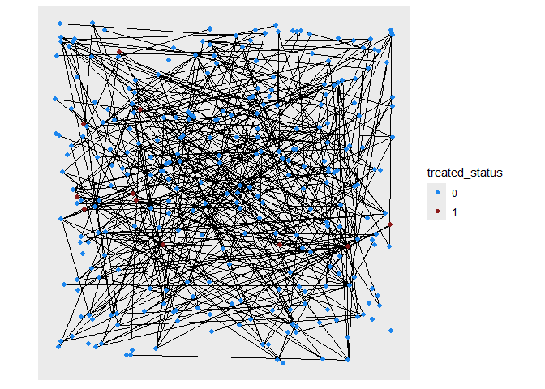

Since our goal is to study peer effects (in this case the effect of
having treated peers), I also measured how many of a node’s first order
peers (peers it has a direction connection with) are treated. This can
also be expanded into 2nd and 3rd degree peers. This is visualized
below, with the graphs changing in color with the number of treated
peers a node has (circular nodes are untreated, triangular are treated)
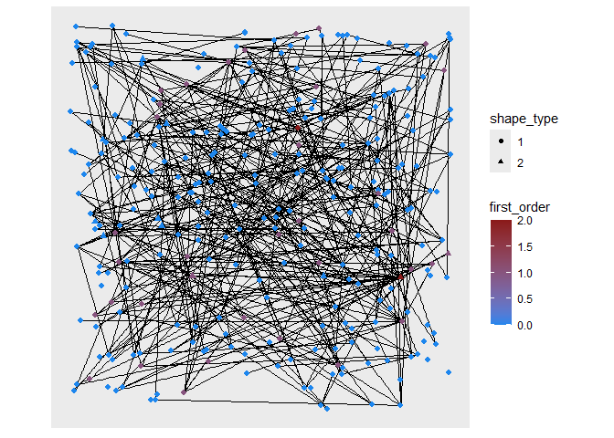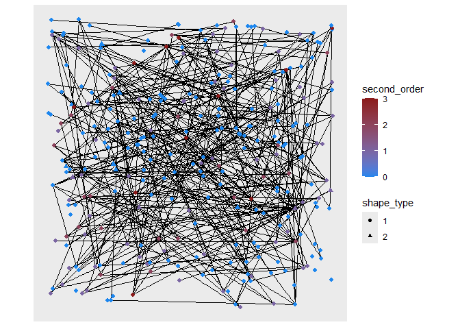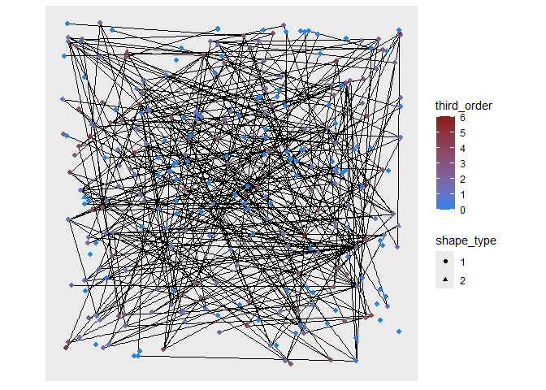

## Peer Effects And Estimating Outcomes

Now that we have assigned treatment status and the number of treated
peers, we can generate outcomes based on treatment status and the status
of peers. There are several ways to accomplish this, so I will go
through each and go over the effectiveness of linear regressions in
estimating peers effects in these situations. In all these situations,
both being treated and having treated peers affects the measured
outcome.

### Threshold Approach

The first approach assumes that having the number treated first order
peers over a certain threshold triggers the peer effect. For this
simulation, the threshold will kick if a node has a single treated peer.
Outcomes are sampled from a normal distribution. The baseline (no
effects from treatment or peers) is sampled from a normal distribution
of mean 5, the treated from a normal distribution of mean 10, and the
peer effect from a normal distribution of mean 7.5, so the marginal
effect of treatment is 5 and of having a treated peer is 2.5. I also
generated an outcome where there are no peer effects (node outcomes are
sampled from either the treated or non-treated normal distribution) as a
comparison.

In the no\_peer regression, I regression outcom\_no\_peer on treated
status and an indicator for treated status, no\_peer.

    ## 
    ## Call:
    ## lm(formula = outcome_no_peer ~ treated + first_order, data = dgp_test)
    ## 
    ## Residuals:
    ##      Min       1Q   Median       3Q      Max 
    ## -1.75620 -0.34657  0.02347  0.32422  1.59188 
    ## 
    ## Coefficients:
    ##             Estimate Std. Error t value Pr(>|t|)    
    ## (Intercept)  5.01821    0.03211 156.300   <2e-16 ***
    ## treated      4.78334    0.15684  30.498   <2e-16 ***
    ## first_order -0.07915    0.08305  -0.953    0.341    
    ## ---
    ## Signif. codes:  0 '***' 0.001 '**' 0.01 '*' 0.05 '.' 0.1 ' ' 1
    ## 
    ## Residual standard error: 0.5061 on 286 degrees of freedom
    ## Multiple R-squared:  0.7664, Adjusted R-squared:  0.7648 
    ## F-statistic: 469.3 on 2 and 286 DF,  p-value: < 2.2e-16

The linear regression effectively identifies the lack of peer effects,
with first\_order not having a statistically significant effect.

In the next regression, I regress peer\_outcome on treated status and if
an individual has at least 1 treated peer.

    ## 
    ## Call:
    ## lm(formula = outcome_peer ~ treated + first_order, data = dgp_test)
    ## 
    ## Residuals:
    ##     Min      1Q  Median      3Q     Max 
    ## -4.1138 -0.3656  0.0152  0.3644  1.4991 
    ## 
    ## Coefficients:
    ##             Estimate Std. Error t value Pr(>|t|)    
    ## (Intercept)  5.04426    0.03845  131.19   <2e-16 ***
    ## treated      3.90879    0.18783   20.81   <2e-16 ***
    ## first_order  2.07865    0.09946   20.90   <2e-16 ***
    ## ---
    ## Signif. codes:  0 '***' 0.001 '**' 0.01 '*' 0.05 '.' 0.1 ' ' 1
    ## 
    ## Residual standard error: 0.6061 on 286 degrees of freedom
    ## Multiple R-squared:  0.7768, Adjusted R-squared:  0.7752 
    ## F-statistic: 497.6 on 2 and 286 DF,  p-value: < 2.2e-16

Again, the linear regression appears to identify a peer effect, although
it slightly underestimates the true effect of having at least 1 treated
peer. To test if this bias is significant, I also simulated the above
data generating process

A histogram of the estimated peer effects (the coefficient of
peer\_first) calculated by this simulation is shown below. The red lines
mark the 5th and 95th percentile of estimate coefficients and the purple
line is the mean of all the coefficients

    ## `stat_bin()` using `bins = 30`. Pick better value with `binwidth`.

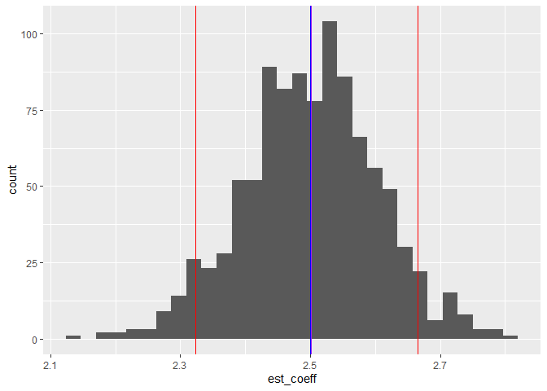

As can be seen, the mean is at or very near to 2.5, indicating that
linear regression is an effective method for estimate peer effects in
this data generating process.

### Continous Approach

However, although this threshold approach to generating data is simple,
it may not be realistic. A more continous approach, where the size of
the peer effect a node experience depends on the number of treated peers
the node has, may be more appropriate. To simulate that situation, peer
effects are simulated by sampling from a normal distribution where the
mean of the distribution for each node equals 5 + 5*treated +
3.5*(first\_order) + 0.75*(second\_order) + 0.25*(third\_order). A
node’s mean is then a function of whether a node is treated and the
number of first, second, and third order peers it has. I have modeled
this DGP and visualized it with the graph below (again, triangles are
treated nodes and circles untreated nodes)

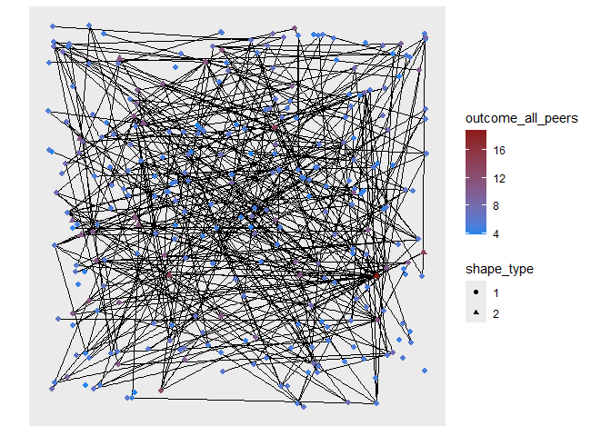

We can also test the effectiveness of linear regression in identifying
peer effects by running the regression outcome\_all\_peers ~ treated +
first\_order + second\_order + third\_order.

    ##                  First Order Second Order Third Order
    ## Actual Effect       3.500000    0.7500000   0.2500000
    ## Estimated Effect    3.529558    0.7749882   0.2818426

These results suggests that linear regression can produce estimates of
peer effects close to the true value. To confirm this, I ran the above
regression 500 times, randomly generating a new treatment vector each
time and recording the estimated coefficients of first order, second
order, and third order peers.

Comparing the mean of the first degree peer coefficients with the actual
effect of first degree peers, demonstrates that linear regression has
little bias in its estimate.

    ## [1] 0.0008460986

The bias is very small in this situation. This can also be seen in the
histogram of the coefficients, with the mean, 5th, and 95th percentiles
of the estimates marked.

    ## `stat_bin()` using `bins = 30`. Pick better value with `binwidth`.

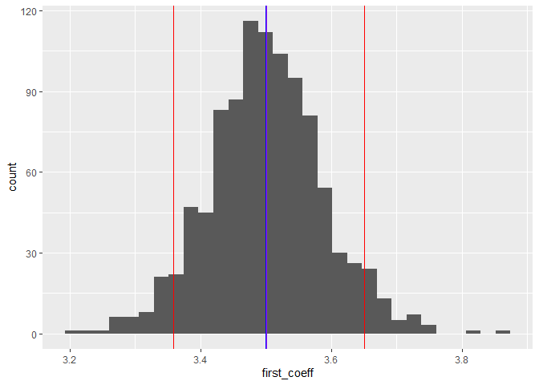

We can repeat this same approach for second degree peers.

    ## [1] 0.00243499

    ## `stat_bin()` using `bins = 30`. Pick better value with `binwidth`.

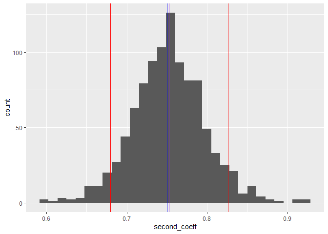

And third degree peers.

    ## [1] -9.353409e-05

    ## `stat_bin()` using `bins = 30`. Pick better value with `binwidth`.

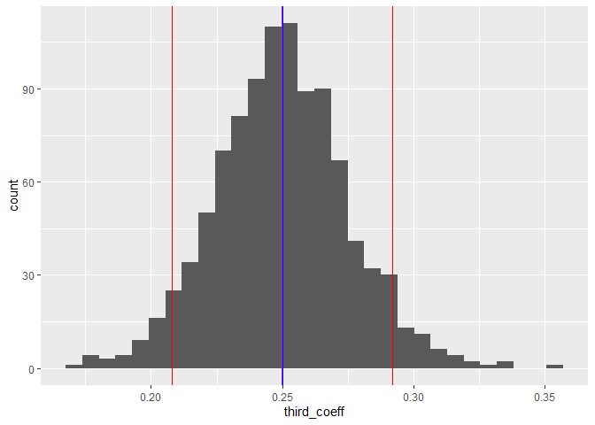

### Group Approach

Another data generating process I examined was the proportion of treated
peers in a group. For some context, when R generated the social network,
nodes were grouped into clusters using the group\_infomap() function,
which groups nodes by minimizing description length. If we see this
clusters as representing groups such as classrooms or social media
groups (like FB groups), we could also model peer effects depending on
the number of treated peers in an individual’s group. In this data
generating process, outcomes of treated individuals are sampled from a
normal distribution with mean 5 + 5 \* (treated) + 4\*(mean\_treat),
with mean\_treat being the proportion of treated nodes in a cluster. The
estimated marginal effect of mean\_treat is then 4. Regressing outcome
on treated and mean\_trear gives the below results

    ## 
    ## Call:
    ## lm(formula = cluster_peer_outcome ~ treated + mean_treat, data = dgp_data)
    ## 
    ## Residuals:
    ##     Min      1Q  Median      3Q     Max 
    ## -3.1932 -0.6421 -0.0279  0.6079  2.3613 
    ## 
    ## Coefficients:
    ##             Estimate Std. Error t value Pr(>|t|)    
    ## (Intercept)   4.9742     0.0618  80.488  < 2e-16 ***
    ## treated       4.4221     0.3174  13.934  < 2e-16 ***
    ## mean_treat    4.3581     0.7818   5.575 5.74e-08 ***
    ## ---
    ## Signif. codes:  0 '***' 0.001 '**' 0.01 '*' 0.05 '.' 0.1 ' ' 1
    ## 
    ## Residual standard error: 0.9434 on 286 degrees of freedom
    ## Multiple R-squared:  0.5469, Adjusted R-squared:  0.5437 
    ## F-statistic: 172.6 on 2 and 286 DF,  p-value: < 2.2e-16

The coefficient for mean\_treat appears to slightly underestimate the
true marginal effect of mean\_treat. We can test if this bias is
significant by running multiple simulations with different treatment
vectors.

    ## [1] 3.999912

    ## [1] -8.844171e-05

The mean of the coefficients for rate\_treat is very close to 4 and has
a small bias. We can also graph the estimated coefficients to look at
their spread. The blue line is the true effect, the purple is the mean
of the coefficients, and the red lines mark the 5th and 95th
percentiles. As can be seen, 90% of the coefficients are estimated with
0.5 of the true effect.

    ## `stat_bin()` using `bins = 30`. Pick better value with `binwidth`.

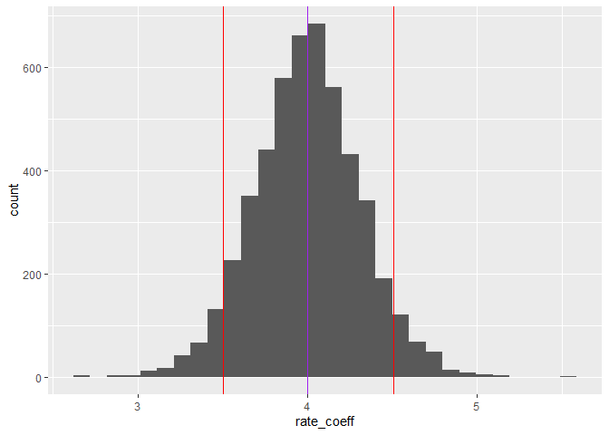

### Group Shocks

One potential concern for identifying peer effects is that linear
regressions that attempt to identify peer effects may just be capturing
shocks that are specific to groups rather than true peer effects. To
test this, I also ran a data generating process that simulated group
shocks and tested if regressing outcomes on treated, first\_order,
second\_order, and third\_order and regressing outcome on treated and
mean\_treat identified peer effects when they did not exist.

    ## 
    ## Call:
    ## lm(formula = outcome_cluster ~ treated + first_order + second_order + 
    ##     third_order, data = dgp_data)
    ## 
    ## Residuals:
    ##     Min      1Q  Median      3Q     Max 
    ## -2.0163 -0.4716 -0.0070  0.4243  2.1428 
    ## 
    ## Coefficients:
    ##              Estimate Std. Error t value Pr(>|t|)    
    ## (Intercept)   6.94930    0.05866 118.460   <2e-16 ***
    ## treated       4.95173    0.21986  22.523   <2e-16 ***
    ## first_order  -0.23202    0.13841  -1.676   0.0948 .  
    ## second_order  0.13637    0.07116   1.916   0.0563 .  
    ## third_order   0.02113    0.03463   0.610   0.5422    
    ## ---
    ## Signif. codes:  0 '***' 0.001 '**' 0.01 '*' 0.05 '.' 0.1 ' ' 1
    ## 
    ## Residual standard error: 0.6977 on 284 degrees of freedom
    ## Multiple R-squared:  0.6496, Adjusted R-squared:  0.6447 
    ## F-statistic: 131.6 on 4 and 284 DF,  p-value: < 2.2e-16

    ## 
    ## Call:
    ## lm(formula = outcome_cluster ~ treated + mean_treat, data = dgp_data)
    ## 
    ## Residuals:
    ##      Min       1Q   Median       3Q      Max 
    ## -2.12122 -0.47158  0.00383  0.42977  2.06777 
    ## 
    ## Coefficients:
    ##             Estimate Std. Error t value Pr(>|t|)    
    ## (Intercept)  7.02437    0.04616 152.169   <2e-16 ***
    ## treated      4.90809    0.23704  20.705   <2e-16 ***
    ## mean_treat  -0.14137    0.58395  -0.242    0.809    
    ## ---
    ## Signif. codes:  0 '***' 0.001 '**' 0.01 '*' 0.05 '.' 0.1 ' ' 1
    ## 
    ## Residual standard error: 0.7047 on 286 degrees of freedom
    ## Multiple R-squared:   0.64,  Adjusted R-squared:  0.6375 
    ## F-statistic: 254.2 on 2 and 286 DF,  p-value: < 2.2e-16

In both regression, the group shocks do “break” the linear regression
model and identify peer effects when they don’t exist. To further
support this, I ran the above regressions 500 times, randomizing the
treatment vector each time.

I will just focus on the coefficients of the first degree peer and the
rate coefficients. Starting with the first degree peer, the average of
the estimate coefficients is very close to 0 and a small bias.

    ## [1] -0.01855023

    ## [1] -0.01855023

    ## `stat_bin()` using `bins = 30`. Pick better value with `binwidth`.

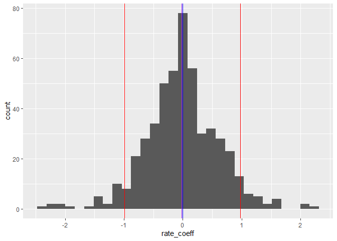

Then we will move onto the first degree peer coefficient.

    ## [1] 0.01490467

    ## [1] 3.500846

    ## `stat_bin()` using `bins = 30`. Pick better value with `binwidth`.

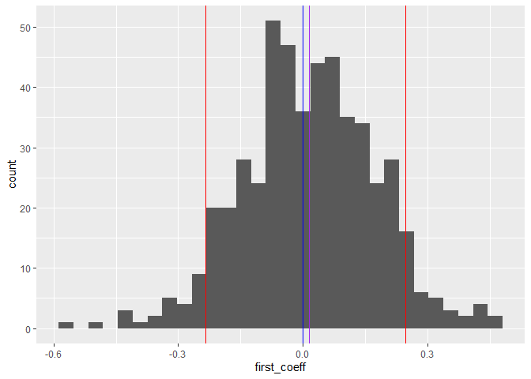

In both cases, it appears that the linear regression correctly
identifies the lack of peer effects.

## Potential Errors

Finally, I wanted to look at the effectiveness of linear regression when
the social network cannot be observed but groups can be. To do this, I
will use the continuous data generating process but will not regress the
outcome on treated and the number of treated peers a node has. Instead,
I will estimate the peer effect by finding the difference between the
coefficients of treated from the OLS and 2SLS regressions of outcomes on
treated. In the latter regression, treatment status is instrumented by
cluster membership. This is the method described by Angrist in the
peril’s of peer effects. This approach should estimate the average
treatment effect (ATE) of having treated peers. To find the “true”
baseline, I added a variable act\_peer\_effect, the actual effect of
having treated peers and took its means for the social network. As that
is the average effect of treated peers, it should be close to the ATE
estimated by finding the difference between OLS and 2SLS regression
coefficients.

    ## [1] 1.202422

    ## [1] 9.724776

The first value is the true ATE of treated peers while the second value
is the estimate. As you can see, Angrist’s approach overestimates the
ATE. To further demonstrate this, I’m going to run another simulation
randomly changing the treatment vector.

Plotting a histogram of these results shows Angrist’s methods
consistently overestimate the ATE of peers.

    ## `stat_bin()` using `bins = 30`. Pick better value with `binwidth`.

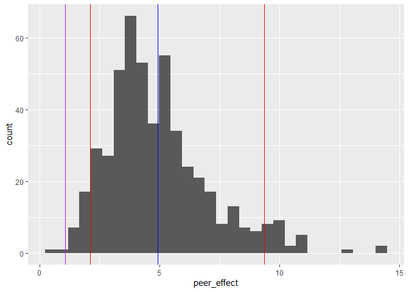

    ## `stat_bin()` using `bins = 30`. Pick better value with `binwidth`.

